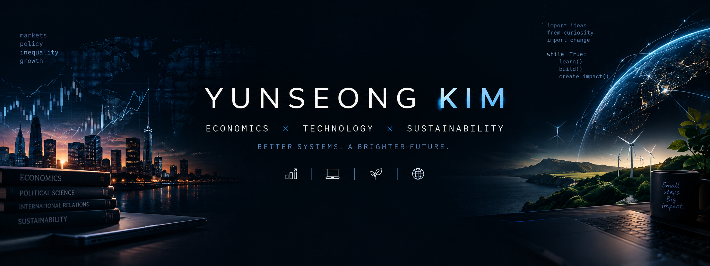

<!-- ===================================================== -->
<!--                     HERO BANNER                       -->
<!-- ===================================================== -->

 

  

# Hi, I'm Yunseong Kim 👋

 

**Student • Builder • Economics & Technology**

 

I'm interested in the intersection of **economics, technology, and sustainability**.

 

---

<!-- ===================================================== -->
<!--                    CURRENT WORK                       -->
<!-- ===================================================== -->

## 🚀 What I'm Working On

- 🌱 Building projects that connect **technology with real-world problems**
- 💡 Exploring **economics, business, and public policy**
- 💻 Learning and building with **Python, JavaScript, React, and web technologies**
- 📊 Researching **economics, markets, inequality, and public policy**
- 🌏 Exploring how technology can address **environmental and social challenges**

 

---

<!-- ===================================================== -->
<!--                   LANGUAGES / TOOLS                   -->
<!-- ===================================================== -->

## 🛠️ Languages & Tools

  

 

---

<!-- ===================================================== -->
<!--                  PROJECTS ARTWORK                     -->
<!-- ===================================================== -->

 

<!-- ===================================================== -->
<!--                  FEATURED PROJECTS                    -->
<!-- ===================================================== -->

## 💻 Featured Projects

<table>
<tr>

<td width="50%" valign="top">

### ♻️ Wastify

**AI-powered food waste marketplace**

A platform connecting businesses that generate food waste with facilities that can reuse or process it.

 

`AI` `Sustainability` `B2B` `Marketplace`

</td>

<td width="50%" valign="top">

### 🌴 Jeju Festa

**Discover Jeju's festivals**

A web platform making Jeju's festivals and cultural events easier to discover, especially for international visitors.

 

`React` `Tailwind CSS` `Vercel`

</td>

</tr>
</table>

 

<!-- ===================================================== -->
<!--                 DECORATIVE DIVIDER                    -->
<!-- ===================================================== -->

 

<!-- ===================================================== -->
<!--                      INTERESTS                        -->
<!-- ===================================================== -->

## 📚 Interests

 

`📈 Economics`
&nbsp;
`💻 Technology`
&nbsp;
`🚀 Entrepreneurship`

  

`🌱 Sustainability`
&nbsp;
`🔎 Research`
&nbsp;
`🌏 Social Impact`

 

I'm particularly interested in the intersection of **economics, technology, and real-world social issues**.

Some areas I explore:

`Economics` `Markets` `Inequality` `Technology` `AI` `Sustainability` `Public Policy`

 

---

<!-- ===================================================== -->
<!--                     GITHUB STATS                      -->
<!-- ===================================================== -->

## 📊 GitHub Stats

 

---

<!-- ===================================================== -->
<!--                  CONTRIBUTION SNAKE                   -->
<!-- ===================================================== -->

## 🐍 My Contributions

<picture>

  <source
    media="(prefers-color-scheme: dark)"
    srcset="https://raw.githubusercontent.com/yunseongkim1009/yunseongkim1009/output/github-contribution-grid-snake-dark.svg"
  />

  <source
    media="(prefers-color-scheme: light)"
    srcset="https://raw.githubusercontent.com/yunseongkim1009/yunseongkim1009/output/github-contribution-grid-snake.svg"
  />

  

</picture>

 

---

<!-- ===================================================== -->
<!--                      CONNECT                         -->
<!-- ===================================================== -->

## 🌐 Let's Connect

&nbsp;

  

 

Economics × Technology × Sustainability

  

**Thanks for visiting! 🚀**

 

<!-- ===================================================== -->
<!--                    FOOTER ARTWORK                     -->
<!-- ===================================================== -->

